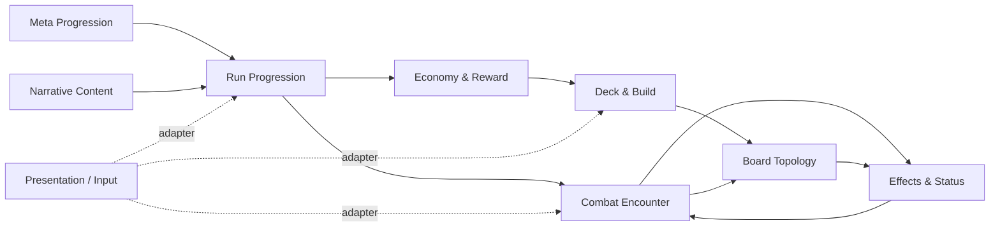
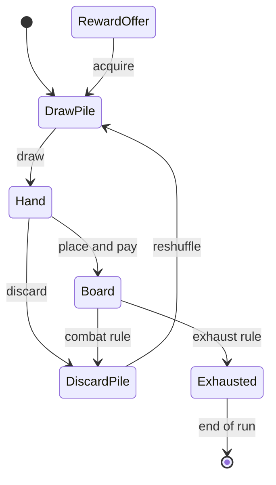

# MagicChronicle 最終ドメインモデル

- 状態: 完了
- 文書版: 2.0.0
- 入力: 仕様初版、Ludus解析、対象コード `ed9846e62728080798edf34f70237689ae807428`
- 目的: ゲームルールをUnityの画面・MonoBehaviourから分離して語れる共通モデルを定義する

## 学生・初学者向け

ゲームを画面やクラス名ではなく、「ラン進行」「戦闘」「盤面」「デッキ」「効果」「報酬」「恒久進行」「物語」の八つの責任へ分ける。重要なのは、弾道と魔法陣の結果を盤面ドメインが決め、Unityは入力と表示を担当することである。

## 高解像度データ

仕様上の八ドメイン名と説明を正本とし、Anatomiaの所属推定は検証データとして分離する。現在は422/424関数が何らかのドメインへ割り当たるが、264関数が重複し29件の境界ドリフト候補があるため、高い所属率だけで境界品質を判断しない。

## ドメイン地図

Presentation / Inputはドメインではなく、入力をコマンドへ変換し、結果イベントを表示するアダプターである。音、アニメーション、ドラッグ、画面遷移がルールの正本にならないようにする。

## 1. Run Progression

ラン開始から終了までの状態、マップ、部屋遷移を所有する。

### 集約・値

- `Run`: `RunId`、seed、難易度、現在階層、現在部屋、状態、ラン内資産。
- `RunMap`: 階層と`RoomNode`の有向非巡回グラフ。
- `RoomNode`: 種別、接続先、公開情報、解決状態。
- `RunState`: `NotStarted / SelectingRoom / ResolvingRoom / Rewarding / Cleared / Failed / Abandoned`。

### コマンドとイベント

- `StartRun(seed, character, startingDeck)` → `RunStarted`
- `SelectRoom(nodeId)` → `RoomEntered`
- `CompleteRoom(result)` → `RoomCompleted`, `RewardOffered`
- `FailRun(reason)` → `RunFailed`

### 不変条件

- 現在ノードから接続された未解決ノードだけを選択できる。
- 一つの部屋を二重に解決しない。
- `Cleared / Failed / Abandoned`後にラン内状態を変更しない。

## 2. Combat Encounter

一回の戦闘、ターン、弾の解決、勝敗を所有する。

### 集約・値

- `Encounter`: 参加者、盤面、ターン番号、フェーズ、解決キュー、結果。
- `Combatant`: HP、最大HP、攻撃起点、状態。
- `TurnPhase`: `Planning / PlayerResolution / BoardSettling / EnemyResolution / EndTurn / Reward / Finished`。
- `Projectile`: 所有者、位置、方向、威力、タグ、残り分岐履歴。
- `EnemyIntent`: 次の射出点、軌道に影響する情報、予告精度。

### コマンドとイベント

- `CommitPlacement(plan)` → `PlacementCommitted`
- `ResolvePlayerProjectiles()` → `ProjectileAdvanced`, `MagicCircleTriggered`, `DamageApplied`
- `ResolveEnemyProjectiles()` → 同上
- `AdvancePhase()` → `PhaseChanged`
- `ConcedeEncounter()` → `EncounterLost`

### 不変条件

- フェーズ遷移は一方向で、解決中に新しい配置を受け付けない。
- 勝敗確定後はダメージ、回復、報酬を二重適用しない。
- 全ての結果は決定的な解決キューから順に生成する。

## 3. Board Topology

5x5盤面、魔法陣、接触、方向変更、分岐、耐久を所有する。このドメインが本作の中核である。

### 集約・値

- `Board`: 幅5、高さ5の`Cell`集合。
- `Cell`: 座標、地形、配置物。
- `MagicCircleInstance`: 定義ID、向き、残耐久、所有、付与修正。
- `Route`: Projectileが通った座標と発火列。
- `ResolutionQueue`: 安定した順序を持つドメイン操作列。

### コマンドとイベント

- `PlaceMagicCircle(cardInstanceId, coordinate, rotation)` → `MagicCirclePlaced`
- `EnterCell(projectileId, coordinate)` → `MagicCircleTriggered`
- `ChangeDirection`, `SplitProjectile`, `ChangePower`
- `ConsumeDurability(amount)` → `DurabilityChanged`, `MagicCircleDestroyed`

### 解決規則の提案

1. Projectileが次セルへ入る。
2. セル上の魔法陣を一度だけ発火予約する。
3. 発火効果をカード記載順、同順位なら安定ID順でキューへ積む。
4. 効果を一件ずつ適用し、その発火の耐久を消費する。
5. 耐久0なら破壊イベントをキュー末尾へ積む。
6. 分岐弾は親弾の直後へ、方向の安定順で積む。
7. 盤外・停止・対象命中まで繰り返す。

正式仕様では、破壊時効果と次の弾のどちらが先か、同一魔法陣への再入場、無限ループ上限を決定する必要がある。

### 不変条件

- 一つのセルに置ける盤面オブジェクト数は仕様上限以下。
- 耐久は0未満にならず、0の魔法陣は後続弾へ作用しない。
- 同じ入力、seed、初期状態から同じイベント列を得る。
- 一つのProjectileに発火数または移動数の安全上限を置く。

## 4. Deck & Build

カードの定義とインスタンス、各ゾーン、ドロー、配置コスト、報酬によるデッキ変更を所有する。

### 集約・値

- `DeckBuild`: 所有カードインスタンスとラン内修正。
- `CardDefinition`: 表示名、コスト、タグ、魔法陣定義、基礎効果。
- `CardInstance`: 一意ID、強化段階、ラン内修正。
- `CardZone`: `DrawPile / Hand / DiscardPile / Exhausted / Board / RewardOffer`。
- `BuildTag`: `Combo / Berserker / Technical / Spirit`等。

### 状態遷移

### 不変条件

- 一つのカードインスタンスは同時に一つのゾーンにだけ属する。
- コスト不足なら配置確定しない。
- 山札再構築は捨て札を一度だけ移し、空のままならドローを終了する。
- 除外カードを通常の捨て札へ戻さない。

## 5. Effects & Status

魔法陣効果、バフ、デバフ、トリガー、スタック、寿命を統一して所有する。

### 集約・値

- `EffectDefinition`: 対象、契機、演算、優先度、タグ。
- `StatusInstance`: 定義ID、付与先、スタック、残回数、残ターン。
- `Trigger`: `OnPlace / OnProjectileEnter / OnDestroyed / OnDamage / OnDraw / OnEnemyAttack / OnTurnEnd`。
- `Modifier`: 加算、乗算、置換、禁止。

### 不変条件

- 全状態に消費契機と寿命を必須とする。
- 同名状態の重複規則を`Add / Refresh / Replace / Reject`から選ぶ。
- 置換・禁止・乗算・加算の順を固定する。
- UI文言と実際の契機は同じ定義から生成する。

## 6. Economy & Reward

ラン内通貨、報酬候補、店、鍛冶屋、価格、支払いを所有する。

### 集約・値

- `RunWallet`: 通貨種別と残高。
- `RewardOffer`: 候補、選択数、期限、取得済み状態。
- `ShopInventory`: seed付き商品列、価格、売切れ状態。
- `UpgradeOffer`: 対象カード、変化内容、価格。

### 不変条件

- 支払いと取得は一つの操作として成功または失敗する。
- 同じ報酬を二重取得しない。
- 価格は購入前に確定し、表示値と決済値を一致させる。
- 通貨の発生源と消費先をイベントとして追跡できる。

## 7. Meta Progression

複数ランを跨ぐ発見、解放、図鑑、チャレンジを所有する。

### 集約・値

- `PlayerProfile`: バージョン、解放、実績、設定参照。
- `Collection`: 発見済みカード・敵・イベント。
- `Unlock`: 条件、対象、受領状態。
- `Challenge`: 制約、記録、報酬。

恒久成長は数値強化より、初期デッキ、キャラクター、カードプール、チャレンジなど横方向の選択肢を優先する。これは「無限に遊べる」と難易度維持の両立に向く。

## 8. Narrative Content

イベント、選択肢、物語フラグ、エンディング条件を所有する。

### 集約・値

- `NarrativeEvent`: 出現条件、本文、選択肢、効果。
- `StoryFlag`: ラン内／プロフィール内のスコープ。
- `EndingCondition`: Chronicle撃破、Kairos解放、隠しボス等の判定。

### 不変条件

- 選択可能な選択肢が0件のイベントを開始しない。
- 不正なIDでも画面を閉じられる安全なフォールバックを持つ。
- 文言、条件、効果を同じコンテンツIDで追跡できる。

## ドメイン間イベント

| 発行元 | イベント | 主な購読先 | 意味 |
|---|---|---|---|
| Run | `RoomEntered` | Combat / Narrative / Economy | 部屋種別に応じた解決開始 |
| Deck | `MagicCirclePlaced` | Board / Economy / Presentation | カード移動とコスト支払い後の配置 |
| Board | `MagicCircleTriggered` | Effects / Presentation | 効果適用と演出 |
| Board | `MagicCircleDestroyed` | Effects / Deck / Presentation | 破壊時効果とゾーン移動 |
| Encounter | `EncounterWon` | Run / Economy / Meta | 部屋完了と報酬生成 |
| Encounter | `EncounterLost` | Run / Meta | ラン終了または例外的継続 |
| Economy | `RewardSelected` | Deck / Run / Presentation | デッキ・資産更新 |
| Narrative | `StoryFlagChanged` | Run / Meta | 分岐・解放・結末判定 |

## 共通語彙

| 用語 | 定義 |
|---|---|
| 魔法陣 | 盤面セルへ配置され、弾の接触で発火するルールオブジェクト |
| カード | 魔法陣を配置する権利と定義を持つ、ゾーン間を移動するインスタンス |
| 発火 | 接触等の契機で効果を解決キューへ登録すること |
| 耐久 | 発火で消費され、0で魔法陣を盤面から除く回数資源 |
| 自弾／敵弾 | 所有者がプレイヤー／敵のProjectile。盤面規則は共有する |
| 連鎖 | 一つの入力から複数の発火・分岐・破壊時効果が因果的に続くこと |
| ラン | 開始デッキ選択からクリア・失敗・放棄までの一回の進行 |
| 恒久 | ラン終了後もプロフィールへ残る状態 |

## 現コードへ導入する際の境界

新しいルールを画面Managerへ追加せず、純粋なドメイン操作として実装し、Unity側はコマンド送信とイベント表示に限定する。特に`UIManager_Battle`、`UIManager_Boss`、`GameManager`へ新しい分岐を集中させない。段階移行では、まずカードゾーン、次に解決キュー、最後にラン状態を抽出する順が安全である。

## 不足情報

- 八ドメインごとの正式な所有者と変更承認者
- 解決キュー、カード領域、ラン終了、恒久状態の確定規則
- scene/prefab/ScriptableObjectを含む実行時の境界

## 不足実装

- Unity非依存の`ResolutionQueue`、`CardZone`、`RunState`値オブジェクト
- ドメインイベントとUnity演出を接続する一方向アダプター
- 各不変条件を検査するEditModeテスト
