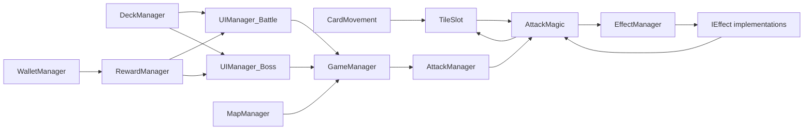
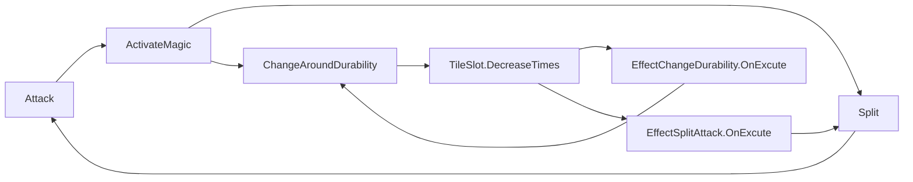

# Anatomia コード・ドメイン詳細解析

- 文書版: 0.1.0
- 対象コード: `ed9846e62728080798edf34f70237689ae807428`
- 生成物: `../../report/architecture-review.html`、`../data/anatomia-architecture-review.json`
- 実行方式: ビルド済みAnatomiaをローカルで直接実行。常駐サービスは不使用。

## エグゼクティブサマリ

現コードは、遊べる縦切りをUnityのシーンとManager群へ迅速に組み上げた構造である。一方、本作固有のルールである弾道、発火、分岐、耐久、カード移動、ターン遷移がUI・MonoBehaviour・共有Managerへまたがっている。個々の関数の循環的複雑度は最大9と極端ではないが、呼び出し結合、循環、共有状態、Battle/Bossの重複が変更リスクを押し上げている。

Anatomiaの設計強度は**59.4/100**である。ただし、99.3%のドメインカバレッジと98.6%の凝集度は、421実装要素がほぼ全て汎用`state-machine`一領域へ分類された結果であり、ゲームドメインが強く設計されていることを意味しない。実際の改善判断では、サイクル健全性0、仕様リンク0、God Class健全性45.8、ディレクトリモジュール性53.2を重く見る。

## 解析規模

| 指標 | 値 |
|---|---:|
| ファイル | 120 |
| 関数 | 424 |
| 解決済み呼び出し | 347 |
| 未解決呼び出し | 764 |
| スキップ | 0 |
| 検出ドメイン | 2 |
| ホットスポット | 50 |
| 循環グループ | 12 |
| 静的fan-in 0の関数 | 129 |
| 仕様リンク不足 | 120 |

未解決764件の内訳は`no-local-candidate` 659、`unresolved-receiver` 48、`abstract-no-impl` 29、`external-type` 28である。Unity API、コンポーネント取得、イベント、コルーチン等を多用するため、静的コールグラフは実行時配線を全て捉えない。

## コードグラフの中心

この中心は、ルール→表示の一方向ではなく、UI、Manager、盤面、効果が相互に呼び戻す構造である。特に盤面解決の循環と、二つのUIManagerが同じデッキ操作を持つ点が変更伝播の主因となる。

## 複雑度と結合

| 優先 | 関数 | cyclomatic | fan-out | coupling | 読み取り |
|---:|---|---:|---:|---:|---|
| 1 | `AttackMagic.Attack` | 9 | 16 | 19 | 本作の弾道ルール中心。分岐・接触・状態・終了条件を分離すべき |
| 2 | `CardMovement.OnEndDrag` | 9 | 17 | 17 | 入力、妥当性、支払い、配置、UI更新が一つのイベントに集中 |
| 3 | `GameManager.Update` | 7 | 7 | 11 | cross-domain depth 10、shared-state fan-in 4。フレーム更新が状態機械を兼ねる |
| 4 | `CardMovement.OnBeginDrag` | 6 | 13 | 13 | 入力開始時に多数のゲーム状態へ依存 |
| 5 | `ShopManager.InitShop` | 6 | 9 | 11 | 在庫生成と表示初期化の境界が薄い |
| 6 | `MapView.CreateMap` | 6 | 7 | 8 | 生成データとView構築が近接 |
| 7 | `TileSlot.DecreaseTimes` | 4 | 23 | 25 | cyclomaticは低いがfan-out最大級。破壊が多くの副作用を起動 |
| 8 | `AttackMagic.ActivateMagic` | 3 | 22 | 24 | 効果ディスパッチと盤面変更の結節点 |

高いcyclomaticだけを分割しても十分ではない。`DecreaseTimes`と`ActivateMagic`は条件分岐よりも、変更先の多さと循環が危険である。解決キューから純粋なイベント列を返し、表示・音・オブジェクトプールを購読側へ移すことが効く。

## 循環

最重要の循環は次の7関数で構成される。

これは偶発的なUI循環ではなく、「効果が次の攻撃や耐久変化を直接呼ぶ」ルール表現そのものに由来する。再帰的な相互呼び出しを明示的な`ResolutionQueue`へ置き換えると、発火順、無限連鎖上限、リプレイ、プレビュー、テストを同時に改善できる。

12循環グループには自己参照やUnity/Editor由来の小さなグループも含まれるため、全件を同じ重大度では扱わない。上記の戦闘循環を最優先とする。

## God Classリスク

指標は、メソッド数30%、外部fan-out 25%、ドメイン横断25%、総cyclomatic 20%のヒューリスティックである。70以上がcritical、50以上がreview candidateであり、本対象にcriticalはない。

| クラス | リスク | methods | fields | total cyclomatic | 判断 |
|---|---:|---:|---:|---:|---|
| `UIManager_Battle` | 54.2 | 25 | 16 | 48 | 要分割。UI表示にデッキ・報酬・手札操作が混在 |
| `UIManager_Boss` | 54.2 | 25 | 16 | 48 | Battle版とのほぼ並行実装が修正漏れを生む |
| `GameManager` | 50.7 | 17 | 31 | 40 | 状態、シーン、入力、共有データの所有が集中 |
| `TaskManagerWindow` | 49.6 | 21 | 24 | 47 | Editor専用。出荷ゲームの優先度は低い |
| `CriAudioManager` | 45.2 | 23 | 7 | 38 | インフラ。API面積は広いがドメイン中核ではない |
| `CardMovement` | 42.2 | 13 | 28 | 40 | 入力アダプターがルール判断まで所有 |
| `AttackMagic` | 32.9 | 10 | 18 | 24 | スコアより重要度が高い。中核ルールと演出が混在 |

`UIManager_Battle`と`UIManager_Boss`は同値であり、同種の`ClearCard`、`CreateCard`、`DrawCard`、`HandOrganize`、報酬・コスト表示を別々に持つ。共通Presenter/HandControllerを抽出し、戦闘種別差は設定またはStrategyへ寄せるべきである。

## ドメイン貧血度

自動分類は`state-machine`へ421要素を集約し、貧血リスク18（高信頼）、内部行動参加73.2%、凝集98.6%、孤立比26.8%と出した。しかし、この低リスク値は**意味のあるゲームドメイン境界が見つかった結果ではない**。分類が粗すぎるため、ほぼ全コードが一つの内部領域になり、境界支配が過小評価されている。

人手で定義した8ドメインに照らすと、実装は次の意味で貧血傾向がある。

- `CardData`、`DeckData`、`EnemyData`等は定義データで、状態遷移の多くをManager/UIが所有する。
- 盤面セル`TileSlot`が配置、耐久、破壊副作用を持ち、独立した解決ルールモデルがない。
- `GameManager`とUIManagerがフェーズ・ドロー・デッキ移動を直接調整する。
- ラン、報酬取引、イベント選択に明示的な集約と不変条件がない。

したがって「データクラスにメソッドを増やす」のではなく、`DeckZones`、`ResolutionQueue`、`RunState`、`RewardTransaction`という振る舞いと不変条件の単位を抽出する。

## 孤立関数の詳細レビュー

静的fan-in 0は129件だが、そのまま削除候補にはできない。

### 高確率の偽陽性

- Unity lifecycle: `Awake`、`Start`、`Update`、`OnEnable`、`OnDisable`、`OnDestroy`。
- EventSystem: `OnBeginDrag`、`OnDrag`、`OnEndDrag`、`OnPointerClick`。
- Unity Editor: `OnGUI`、`OnInspectorGUI`、`GetPropertyHeight`、`OnValidate`。
- Scene/PrefabやInspectorのUnityEvent、コルーチン、reflectionから呼ばれるpublicメソッド。

### 確認価値の高い候補

| 候補 | 観測 | 推奨確認 |
|---|---|---|
| `GameManager.ChangePlayerType` | C#およびテキストアセット参照を検出せず | キャラクター選択予定APIか、未使用なら削除 |
| `GameManager.GivePlayerBuffData` | 参照を検出せず | 旧APIか将来用かを確認 |
| `AudioManager.PlayBGM` | `CriAudioManager`と音声責務が重複 | 旧AudioManagerの利用シーンを棚卸し |
| `CriAudioManager.Stop/Pause/Resume/CrossFadeBgm` | 静的参照なし | 公開APIとして意図的か、実未使用かをscene実行で確認 |
| `CardEncyclopedia.Filter/Sort`群 | 静的参照なし | runtime listenerまたは未接続UIを確認 |
| `CharacterBase.IncreaseMaxHP/RecoveryHP/AddPower` | 静的参照なし | ScriptableObject/イベント経由の有無を確認 |
| `RewardManager.RewardSkip` | 静的には孤立だが`AddListener`で自己登録 | **使用中。削除不可** |

孤立関数の受け入れ基準は、(1) C#参照なし、(2) scene/prefab/animation参照なし、(3) interface/override/lifecycleでない、(4) reflection・文字列呼び出し契約なし、(5) PlayMode到達なし、の全てを満たすこととする。

## モジュール性と仕様リンク

- ディレクトリ単位モジュール性: **0.532**（設計強度へ53.2として利用）。
- クラス単位モジュール性: **0.250**。
- 仕様リンク: **0%**、120ファイル全てが未リンクとして検出。

`spec`にMarkdownがあるだけではコード要素との明示リンクにならない。受け入れ条件ID（例`BAT-RES-001`）をテスト名、主要ルール型のコメントまたはトレーサビリティ表へ接続する。全ファイルへコメントを貼るのではなく、ルールの正本となる型とテストへリンクする。

## 改善順序

1. `UIManager_Battle/Boss`のドロー不具合と重複を止め、共通のカードゾーン操作へ集約する。
2. `AttackMagic ↔ TileSlot ↔ Effect`循環を明示的解決キューへ置換する。
3. `CardMovement`から配置妥当性、コスト支払い、カード状態遷移を分離する。
4. `GameManager.Update`の状態機械を`RunState`と`TurnPhase`へ分ける。
5. Unity非依存のユニットテストでカード保存則、決定性、耐久、分岐上限を固定する。
6. 8ドメインと主要コード・テストのトレーサビリティをAnatomia入力へ接続する。

## 指標の限界

God Class、設計強度、ドメイン貧血度は比較と優先順位づけの補助であり、リリースゲートではない。未解決呼び出しが多いUnityプロジェクトでは、scene/prefabと実行時プロファイルを加えない限り、孤立・fan-in・ドメイン横断を過小または過大評価する。最終判断は仕様、コード読解、PlayModeテストと組み合わせる。
