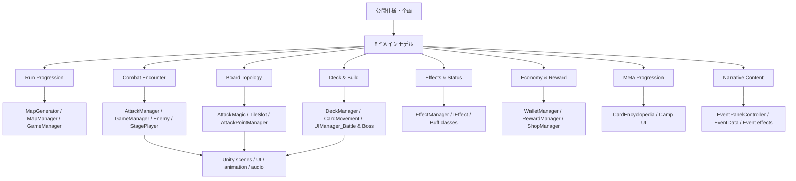

# 仕様・ドメイン・コード配線表

- 文書版: 0.1.0
- 対象: MagicChronicle `ed9846e62728080798edf34f70237689ae807428`
- 状態語: `implemented` / `partial` / `missing` / `conflict` / `defect`

## 全体配線

## トレーサビリティ

| 要件ID | 仕様・不変条件 | ドメイン | 現コード | 状態 | 検証・不足 |
|---|---|---|---|---|---|
| RUN-001 | 接続された次の部屋だけ選べる | Run | `MapGenerator`, `MapManager`, `MapView`, `Room` | partial | グラフ不変条件、seed決定性、到達不能検査がない |
| RUN-002 | 新規ランで全ラン状態を初期化 | Run | `GameManager`, `DeckManager`, `WalletManager`, `PlayerStatus` | defect | deck/money/buff/mapを一括初期化する契約がない。`GAMEIMPL-001` |
| RUN-003 | 勝利・敗北・放棄で一度だけ終了 | Run | `GameManager.SceneChange`, battle UI | partial | 終了状態と持越し対象が明示されない |
| RUN-004 | 部屋結果が報酬または次遷移へ接続 | Run/Economy | `RewardManager`, `MapManager` | partial | 二重取得防止、再入場、報酬未選択時の扱いが未定 |
| BAT-001 | 配置→自弾→敵弾→終了の順 | Combat | `GameManager.Update`, `AttackManager.AttackTurn/EnemyTurn` | implemented | 状態機械が複数Managerへ分散。順序テストなし |
| BAT-002 | 解決中は配置変更不可 | Combat/Deck | `CardMovement`, UI input state | partial | 入力可否がUI状態に依存。単一フェーズガードがない |
| BAT-003 | 勝敗後はダメージ・報酬を二重適用しない | Combat | `Enemy.Dead`, UI reward, scene change | partial | 冪等なEncounterResultがない |
| BAT-004 | HPは0〜最大値 | Combat | `CharacterBase` | defect | `Healed`がClamp結果を代入せず回復不能。`CODE-001` |
| BRD-001 | 5x5盤面へ魔法陣を配置 | Board | `StageManager.CreateStage`, `TileSlot.PlaceCard` | partial | サイズは構成依存。5x5と配置上限をルール型が保証しない |
| BRD-002 | 接触で効果を発火 | Board/Effects | `AttackMagic.ActivateMagic`, `EffectManager` | implemented | 発火順が相互呼出しで暗黙的 |
| BRD-003 | 発火ごとに耐久減、0で消滅 | Board | `TileSlot.DecreaseTimes`, `AttackMagic.DestroyMagic` | partial | 破壊時効果と後続弾の順、端効果に不具合。`CODE-002` |
| BRD-004 | 分岐弾の決定的順序と上限 | Board | `AttackMagic.Split/Attack` | missing | 明示順、無限連鎖上限、seed/replay契約がない |
| BRD-005 | 自弾と敵弾が同じ盤面規則を使う | Board/Combat | `AttackManager`, `AttackMagic` | implemented | 敵意図・射線の予測仕様がない |
| DCK-001 | カードは同時に一ゾーンだけ | Deck | `DeckManager`, `UIManager_Battle/Boss` | defect | exhaust/removedカードを再構築山札へ戻す。`CODE-003` |
| DCK-002 | 空山札は正常にドロー終了 | Deck | `UIManager_Battle/Boss.DrawCard` | defect | 再構築後も空なら`DeckCard[0]`で停止。`CODE-015` |
| DCK-003 | 手札配置だけがコストを消費、盤上移動は差額0 | Deck/Board | `CardMovement` | defect | コスト最大時の盤上移動で差し引き。`CODE-005` |
| DCK-004 | 報酬取得で一枚だけデッキへ追加 | Deck/Economy | `RewardManager`, `RewardCard`, `DeckManager` | partial | 重複・スキップ価値・上限・削除が未定 |
| DCK-005 | 山札/手札/捨て札/除外/盤面の遷移 | Deck | 複数UIManager内のlist操作 | conflict | 仕様未決定かつコードが独自規則を実装 |
| EFF-001 | 全状態にトリガー、寿命、スタック規則 | Effects | `BuffData`, `BuffStacks`, `IBuff`, 各Buff | conflict | 公開資料間で消費契機と式が矛盾 |
| EFF-002 | 状態変化とUI表示を一致 | Effects/UI | `BuffUIManager`, `BuffIcon`, `CharacterBase` | defect | 減少経路の一部でUI同期なし。`CODE-009` |
| EFF-003 | 効果の対象・優先順位を決定的に解決 | Effects | `EffectManager`, 各`IEffect.OnExcute` | partial | 効果がManager/Boardを直接呼び、解決キューがない |
| ECO-001 | 支払いと取得は原子的 | Economy | `WalletManager.TrySpendMoney`, `ShopManager.Buy` | partial | 価格・在庫・購入済みを含む取引モデルがない |
| ECO-002 | 通貨ソースとシンクを追跡 | Economy | `EffectGetMoney`, `WalletManager`, shop/event | partial | 初期値、期待獲得、価格曲線、run/meta分離がない |
| ECO-003 | 報酬候補は一度だけ生成・選択 | Economy | `RewardManager` | partial | seed、希少度、重み、pity、二重選択防止が未定 |
| META-001 | 発見・図鑑・解放をラン間で保存 | Meta | `CardEncyclopedia`, Camp UI | missing | 永続プロフィール、version、migrationがない |
| META-002 | 恒久解放が次ランの横方向選択を増やす | Meta | キャラクター選択案、拠点ショップ案 | missing | 解放条件、通貨、重複、初期デッキが未定 |
| NAR-001 | Event IDは必ず解決し、失敗時も復帰可能 | Narrative | `EventDataBase`, `EventPanelController` | defect | 不正IDでblank panel softlock。`GAMEIMPL-003` |
| NAR-002 | 選択肢の条件・費用・結果を一取引で適用 | Narrative | `EventChoice`, `IEventEffect` | partial | 失敗、キャンセル、再訪、フラグの仕様がない |
| NAR-003 | Chronicle/Kairos分岐と結末条件 | Narrative/Meta | 実装対応なし | missing | 公開ストーリーは筋のみ。ゲーム内提示、周回開示が未定 |
| UX-001 | 自弾・敵弾・発火順・消滅を配置前に読む | Presentation | shadow/attack point系UI | partial | 完全な時系列プレビューは未確認 |
| UX-002 | PC/モバイルで安全に操作 | Presentation | EventSystem/InputSystem参照 | defect | `Mouse.current` null guard、safe area、端末release gateなし。`GAMEQUALITY-001` |
| DATA-001 | 全ScriptableObject ID・参照をビルド前検査 | Data authoring | 各Database `Get*` | missing | integrity validatorなし。null/softlockへ到達し得る |

## コード所有の再配置案

| 現在 | 問題 | 移動先 |
|---|---|---|
| `UIManager_Battle/Boss`内のdraw/reset/hand操作 | 表示クラスがカード保存則を所有し、二重実装 | Unity非依存`RunDeckState` + 共通`HandController` |
| `CardMovement`内の配置・支払い判断 | 入力イベントがドメイン取引を所有 | `PlaceMagicCircleCommandHandler` |
| `AttackMagic`と`TileSlot`の直接相互呼出し | 順序がコールスタック依存 | `ProjectileResolver` + `ResolutionQueue` |
| `GameManager.Update`のrun/phase遷移 | フレームループと状態機械が結合 | `RunStateMachine`、`EncounterStateMachine` |
| `Effect*.OnExcute`から各Managerを直接操作 | 効果の合成・テスト・previewが困難 | `EffectResolution`がドメインイベントを返す |
| ScriptableObject assetのruntime mutation | 次ランへの漏れ、Editor asset汚染リスク | immutable definition + runtime instance |

## 最小テスト配線

| テストID | 入力 | 期待 |
|---|---|---|
| T-BRD-001 | 同じseed・盤面・弾 | 同じイベント列・最終盤面 |
| T-BRD-002 | 角/辺/中央の耐久周囲変更 | 盤内セルだけ全て処理 |
| T-BRD-003 | 分岐と破壊時分岐の連鎖 | 安定順で終了し上限を超えない |
| T-DCK-001 | 全カードが手札/除外、山札0 | 例外なくno-card結果 |
| T-DCK-002 | exhaust後に山札再構築 | exhaustカードが戻らず総数保存 |
| T-DCK-003 | 盤上カードを再配置 | コスト差分0 |
| T-EFF-001 | 各Buffの付与・重複・消費 | 仕様表どおりの値とUIイベント |
| T-RUN-001 | 新規run→敗北→新規run | deck/money/HP/buff/mapが初期値 |
| T-DATA-001 | 重複/欠損IDを含むasset | build前validatorが失敗理由を列挙 |
| T-NAR-001 | 不正Event ID | fallback表示から必ずmapへ復帰可能 |

## 配線上の結論

機能の「存在」は多く確認できるが、仕様ID→純粋ルール→テストの線がない。最初にカードゾーンと解決キューを正本化すると、既存High不具合、Anatomia循環、プレビュー困難、Battle/Boss重複を一つの設計変更で同時に縮小できる。
