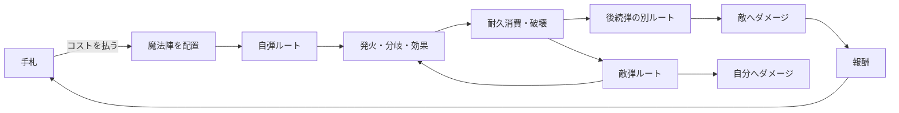

# メカニクス・内部経済・循環・複雑度解析

- 文書版: 0.1.0
- 入力: 仕様、Ludus、ドメインモデル、Anatomia、仕様コード配線
- 注意: 数値表・実測テレメトリがないため、スコアは比較用ヒューリスティックでありバランス合否ではない

## メカニクスの核

本作の最小プレイヤー動詞は三つである。

1. **読む** — 手札、盤面、耐久、敵意図、残資源を読む。
2. **置く** — カードをコストと位置・向きへ変換する。
3. **確定する** — 自分では直接操作しない弾道解決を見届け、次の状態を受け入れる。



本作固有の面白さは`配置→結果`ではなく、**一つの配置が、耐久消費を介して時間順に別の盤面へ変わる**ことにある。敵弾が同じ装置を通るため、プレイヤーは火力、寿命、安全性を一つの配置で同時に最適化する。

## Mechanics–Dynamics–Aesthetics

| Mechanics | 生じるDynamics | 狙う体験 |
|---|---|---|
| 5x5盤面と方向・分岐 | 空間的な経路設計、詰め込みの競合 | ピースがはまる知的快感 |
| 発火ごとの耐久消費 | 同じターン中に盤面が変形 | 先読み、意外性、連鎖のドラマ |
| 敵弾も同じ魔法陣を利用 | 攻撃装置がリスクにもなる | 欲張りと安全の緊張 |
| 手札・コスト | 毎ターンの選択制限 | 即興、やりくり |
| 報酬デッキ構築 | ラン中に解法の分布が変化 | ビルドが育つ所有感 |
| 破壊時発火・自傷・毒 | 通常の「温存」を反転 | 発見、悪用、奥深さ |

狙いは良く接続しているが、結果の因果が読めないと「自分が組んだ爆発」ではなく「自動で何か起きた」に変わる。予測と振り返りは装飾ではなく、メカニクス成立条件である。

## 内部経済の資源台帳

| 資源 | スコープ | 主なSource | 主なSink | Converter / 保存 | 現状 |
|---|---|---|---|---|---|
| HP | encounter/run | 回復効果、イベント、店 | 敵弾、自傷、毒 | 最大HP増加、再生 | 回復コード不具合。run間reset未定 |
| 配置コスト | turn | ターン回復、最大値buff | カード配置 | 最大値増減、カード軽量化案 | 回復周期と持越し未定 |
| カード枚数 | run | 初期デッキ、報酬、店 | exhaust、削除案 | 強化、複製、捨て札再構築 | source優位。除外が再投入される不具合 |
| 手札選択肢 | turn | draw、追加draw | 配置、捨て、手札上限 | 山札再構築 | 空山札停止の不具合 |
| 魔法陣耐久 | encounter | 配置時基礎値、耐久回復 | 発火、破壊効果 | 周囲増減、破壊時価値へ変換 | 最も特徴的で閉じた資源 |
| 弾威力/回数 | resolution | 基礎攻撃、筋力、分岐、連続 | 命中で解決、疲労 | 移動距離→威力、毒付与 | 計算順・多重hit未定 |
| 状態スタック | encounter/run | カード、敵、イベント | trigger消費、時間経過 | 攻撃/防御/回復へ変換 | 寿命と重複が矛盾 |
| 所持金 | run/meta不明 | 戦闘、魔法陣、イベント | 店、回復、鍛冶、解放ガチャ | カード/HP/強化へ変換 | 通貨分離・期待値・価格なし |
| 部屋機会 | run | map生成 | 選択で他ルートを放棄 | リスク→報酬へ変換 | 部屋比率・可視性・seed未定 |
| 情報 | turn/run | 敵意図、preview、図鑑 | 伏せ情報、不確実性 | 学習→より強い配置 | 必須情報の表示仕様が薄い |
| 恒久解放 | profile | achievement、通貨案 | 原則sinkでなく選択肢増加 | 初期条件・カードプール | ほぼ未定義 |

## 主要な経済循環

### 1. コスト循環

`ターン開始で供給 → カード配置で消費 → 盤面価値へ変換 → ターン終了でリセット`

設計として最も理解しやすい短期循環になり得る。未使用分の持越し、最大コスト、軽減と最大値低下の語彙が未定なため、現時点では閉じていない。

### 2. 耐久循環

`カード取得 → 配置時耐久 → 発火で消費 → 破壊または後続弾の経路変化 → ダメージ/資源へ変換`

本作で最もきれいな循環である。同じ値が「効果を何回使えるか」「いつ盤面から消えるか」「破壊時効果をいつ得るか」の三役を持つ。ただし三役を画面で同時に読めること、耐久回復が無限連鎖を作らないことが条件になる。

### 3. カード経済

`戦闘勝利 → カード追加 → 選択肢/シナジー増加 → 勝ちやすくなる → さらにカード追加`

現状は正のフィードバックに偏る。カード追加が常に報酬ならデッキが肥大し、狙った連鎖を引けなくなるため、見かけ上の報酬が罰へ反転する。スキップ報酬、削除、強化、希少度、ビルドtagによる重みづけがsink/quality converterとして必要である。

### 4. HP・所持金・部屋選択

`戦闘でHPを失う → 高報酬ルートか回復/店を選ぶ → 所持金をHPまたは戦力へ変換 → ボス到達`

ローグライト全体の緊張を作る循環だが、回復量、部屋比率、価格、報酬差がないため成立を評価できない。回復が安すぎればHP圧力が消え、高すぎれば店が実質回復専用になる。

### 5. メタ循環

`runで発見/達成 → 横方向の選択肢解放 → 新しい初期ビルド → 別の発見`

企画目標「無限に遊べる」に必要だが未実装・未仕様である。恒久火力だけを増やすとパズルの緊張が減るため、キャラクター、初期デッキ、カードプール、challenge modifier、seed履歴を中心にする。

## 循環のきれいさ

### 暫定スコア

| 観点 | 0–100 | 根拠 |
|---|---:|---|
| Source–Sinkの閉鎖性 | 38 | 耐久は良いが、カード・通貨・buff・metaが未閉鎖 |
| 変換の読みやすさ | 58 | コスト→配置、耐久→発火は明快。効果順と状態式が不明 |
| 時間スコープの整合 | 34 | turn/run/profileの寿命が混在しreset契約がない |
| 正負フィードバックの均衡 | 41 | HP/敵共有は負圧。カード追加と成長はsnowball寄り |
| プレイヤー制御可能性 | 62 | 配置判断は強いが、drawと敵意図の情報量が未定 |
| 監査・テスト可能性 | 25 | イベント台帳、決定的resolver、自動テストがない |
| **総合（暫定）** | **43** | 数値バランス未評価。構造の閉じ方だけを評価 |

43は「面白くない」ではなく、**特徴的な耐久循環は強いが、それを支える周辺経済の境界がまだ閉じていない**ことを表す。P0仕様を決めれば大きく上がる余地がある。

## ルール複雑度

### 複雑度の分解

| 層 | プレイヤーが同時に追うもの | 固有価値 | 過剰化リスク |
|---|---|---|---|
| 入力 | 手札、コスト、位置、向き | 低〜中 | ドラッグ失敗、取り消し不明 |
| 空間 | 25セル、方向、分岐、射出点 | 高 | 経路が重なり視認不能 |
| 時間 | 発火順、複数弾、耐久消滅、敵フェーズ | 非常に高 | 一手先ではなくイベント列全体が必要 |
| 構築 | 山札、draw確率、tag、強化 | 高 | 盤面思考とdraw運が競合 |
| 状態 | HP、buff/debuff、stack、残寿命 | 中〜高 | trigger語彙が不統一 |
| run | map、money、HP、報酬、店 | 中 | 長期最適化の根拠値不足 |

### 暫定評価

- **本質的複雑度: 67/100** — 共有盤面と時間変化が本作の価値なので、単純化しすぎるべきではない。
- **偶発的複雑度: 78/100** — 未定義の順序、語彙不一致、UIManager重複、隠れた状態遷移が理解コストを増やす。
- **望ましい到達: 本質65前後 / 偶発35以下** — 奥深さを維持し、不可解さだけを落とす。

Anatomiaで個別関数の最大cyclomaticが9に留まる一方、12循環、129 static orphan、764 unresolved callがある。これは一つの巨大ifより、イベント・Unity callback・Manager間に散った**分散複雑度**が主体である。

## 複雑度を奥深さへ変える設計

1. 配置中に最終ダメージだけでなく、番号付きの発火列を表示する。
2. 自弾の完全予測を先に教え、敵共有はチュートリアルの次段で解禁する。
3. 分岐、破壊時発火、状態の各語彙を一度に増やさず、runの階層で導入する。
4. カード本文を`Trigger → Effect → Lifetime`の定型文にする。
5. 結果後に3秒程度の因果ログを出し、想定外だけを遡れるようにする。
6. 上級者にはpreview簡略、速度変更、詳細ログを選ばせ、初心者向け支援と同居させる。

## 数値設計の最小モデル

実装前にスプレッドシートまたはシミュレータで次を持つ。

```text
EncounterBudget = ExpectedPlayerHP * TargetLossRate
CardValue = ExpectedDamage + SurvivalValue + DrawValue + EconomyValue
PlacementEfficiency = CardValue / PlacementCost
DurabilityValue = Sum(ExpectedTriggerValue at trigger n) + DestructionValue
RoomEV = RewardEV - ExpectedHPDamageValue - OpportunityCost
DeckQuality = DrawWeightedSynergyValue - DilutionPenalty
```

同じ尺度へ無理に全てを換金するのではなく、比較可能な仮想価値としてバランス差分を見る。特に破壊時価値を通常発火価値と別にしないと、耐久0を早めるカードを正しく評価できない。

## プレイテスト指標

- 配置から確定までの中央値、取り消し回数、無操作時間。
- 予測と実結果が違ったターンの割合と原因。
- 1ターンの発火数、分岐数、盤面変化数、演出時間。
- 被ダメージのうち敵意図を理解していた割合。
- 報酬スキップ率、デッキ枚数、tag集中度、不要札率。
- 金不足で選べなかった部屋/商品、回復への支出比率。
- 敗北時に再挑戦したい割合、別ビルドを試した割合。
- 「自分が連鎖を作った」と答える割合。爽快感の中心KPIとする。

## 結論

盤面耐久は、空間・時間・経済を一つの値で接続する非常に強いメカニクスである。改善の中心はルールを減らすことではなく、カードゾーン、解決順、状態寿命、run resetを閉じ、予測と因果表示でプレイヤーの所有感を守ることにある。
